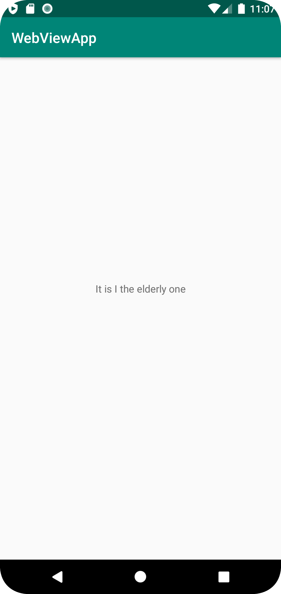

# Rapport

Lösningen av assignment 1 innefattar:

- Tilläggning av <string name="new_hello_world">It is I the elderly one</string> i filen strings.xml
- Ändring av android:text="Hello World!" till android:text="@string/new_hello_world" i filen content_main.xml

Ändringen av uttrycket android:text"" pekar på den tillagda strängen och visas i appen.

```
<resources>
    <string name="app_name">WebViewApp</string>
    <string name="action_external_web">External Web Page</string>
    <string name="action_internal_web">Internal Web Page</string>
    <string name="new_hello_world">It is I the elderly one</string>
</resources>
```
Figur 1, kod till tilläggning av sträng
```
<TextView
        android:layout_width="wrap_content"
        android:layout_height="wrap_content"
        android:text="@string/new_hello_world"
        app:layout_constraintBottom_toBottomOf="parent"
        app:layout_constraintLeft_toLeftOf="parent"
        app:layout_constraintRight_toRightOf="parent"
        app:layout_constraintTop_toTopOf="parent" />
```
Figur 2, kod till förändring av uttrycket android:""


Figur 3, screenshot av ändrad text när appen körs